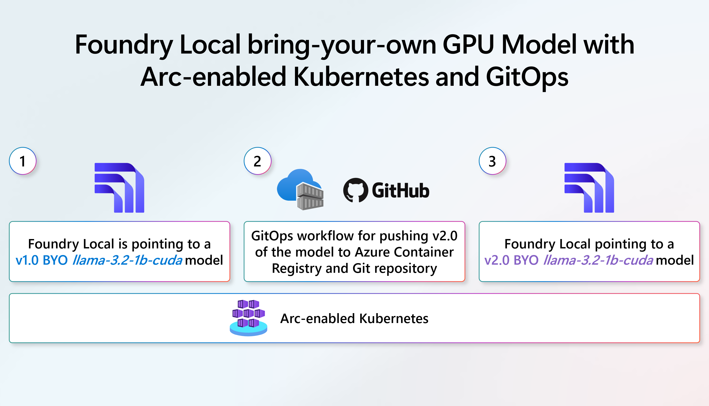
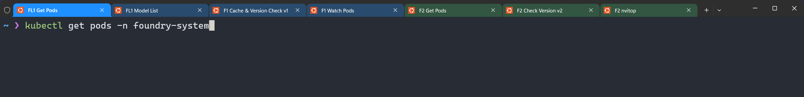
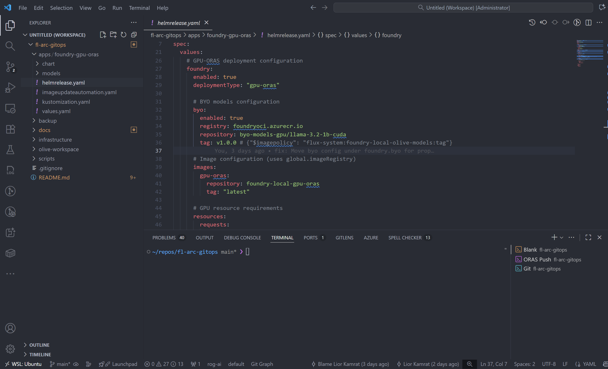
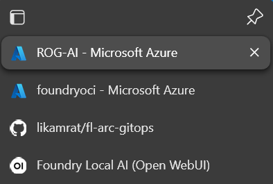
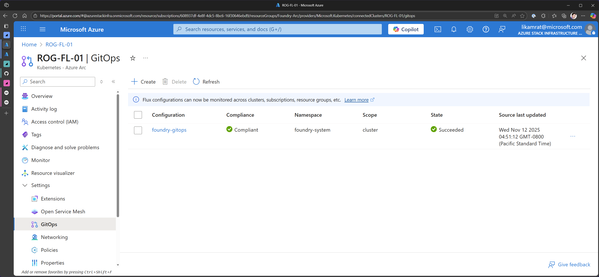

# Demo Flight Check and Talk Track

## 🎯 Demo Pre-Requisites

**Two Arc-enabled Kubernetes Clusters:**
- **ROG-FL-01** (192.168.8.101) - Active GitOps, will upgrade from v1.0.0 → v2.0.0 during demo
- **ROG-FL-02** (192.168.8.102) - GitOps suspended, already at v2.0.0 to show final state

**Required Tools:**
- `kubectx` - Kubernetes context switcher
- `kubectl` - Kubernetes CLI
- `az` - Azure CLI (authenticated with `az login`)
- `oras` - OCI Registry as Storage CLI (authenticated to foundryoci.azurecr.io)
- `git` - Version control

**Pre-Demo Setup Commands:**

> **Note:** Use the automated script for setup: `./scripts/demo/demo-prep.sh`

```bash
# Run the demo preparation script (automates all steps below)
cd ~/repos/fl-arc-gitops
./scripts/demo/demo-prep.sh
```

**Or run manually:**

```bash
# 1. Suspend GitOps on ROG-FL-02 (prevents it from reacting to Git changes)
kubectx rog-fl-02
kubectl patch kustomization foundry-gitops-apps -n foundry-system -p '{"spec":{"suspend":true}}' --type=merge

# 2. Verify both clusters are at v2.0.0 before rollback
kubectx rog-fl-01 && kubectl logs -n foundry-system $(kubectl get pod -n foundry-system -l app.kubernetes.io/component=foundry -o jsonpath='{.items[0].metadata.name}') | grep "Tag:"
kubectx rog-fl-02 && kubectl logs -n foundry-system $(kubectl get pod -n foundry-system -l app.kubernetes.io/component=foundry -o jsonpath='{.items[0].metadata.name}') | grep "Tag:"

# 3. Delete v2.0.0 from ACR
az acr repository delete --name foundryoci --image byo-models-gpu/llama-3.2-1b-cuda:v2.0.0 --yes

# 4. Rollback Git to v1.0.0 (only ROG-FL-01 will react since FL-02 is suspended)
cd ~/repos/fl-arc-gitops
sed -i 's/tag: v2.0.0/tag: v1.0.0/' apps/foundry-gpu-oras/helmrelease.yaml
git add apps/foundry-gpu-oras/helmrelease.yaml
git commit -m "Rollback to v1.0.0 for demo"
git push origin main

# 5. Wait for ROG-FL-01 to rollback to v1.0.0 (~5 minutes)
kubectx rog-fl-01
kubectl get pods -n foundry-system -w

# 6. Verify final demo state
kubectx rog-fl-01 && kubectl logs -n foundry-system $(kubectl get pod -n foundry-system -l app.kubernetes.io/component=foundry -o jsonpath='{.items[0].metadata.name}') | grep "Tag:"  # Should show v1.0.0
kubectx rog-fl-02 && kubectl logs -n foundry-system $(kubectl get pod -n foundry-system -l app.kubernetes.io/component=foundry -o jsonpath='{.items[0].metadata.name}') | grep "Tag:"  # Should show v2.0.0
oras repo tags foundryoci.azurecr.io/byo-models-gpu/llama-3.2-1b-cuda  # Should show only v1.0.0
```

**Post-Demo Cleanup:**

```bash
# Resume GitOps on ROG-FL-02
kubectx rog-fl-02
kubectl patch kustomization foundry-gitops-apps -n foundry-system -p '{"spec":{"suspend":false}}' --type=merge
```

---

## �🎬 Flight Check

### 📊 PowerPoint Setup

> **File:** `docs/pptx/architecture.pptx`

| Slide | Purpose | Content |
|-------|---------|---------|
| Opening Slide | Introduction | Architecture diagram showing GitOps flow for AI model deployments |
| Closing Slide | Summary | Same architecture diagram (display during closing remarks) |



### 💻 Windows Terminal Tabs Setup

> **Note:** All kubectl commands run in Windows Terminal tabs. Start on **rog-fl-01** context.

| Tab&nbsp;# | Purpose | Directory | Commands Ready to Run |
|------------|---------|-----------|----------------------|
| Tab&nbsp;1 | Get Pods (ROG-FL-01) | `~` | `kubectx rog-fl-01 && kubectl get pods -n foundry-system` |
| Tab&nbsp;2 | Model List (ROG-FL-01) | `~` | `kubectl exec -it -n foundry-system $(kubectl get pod -n foundry-system -l app.kubernetes.io/name=foundry-local -o jsonpath='{.items[0].metadata.name}') -- /bin/bash -c "foundry model list"` |
| Tab&nbsp;3 | Cache & Version Check v1 (ROG-FL-01) | `~` | `kubectl exec -n foundry-system $(kubectl get pod -n foundry-system -l app.kubernetes.io/name=foundry-local -o jsonpath='{.items[0].metadata.name}') -- /bin/bash -c "foundry cache list \| tail -n +3 \| sed 's/Model was not found in catalog//' \| awk '{print \$NF}'" && echo "" && kubectl logs -n foundry-system $(kubectl get pod -n foundry-system -l app.kubernetes.io/component=foundry -o jsonpath='{.items[0].metadata.name}') \| grep -E "(Registry:\|Repository:\|Tag:)" \| grep -v "UserAgent"` |
| Tab&nbsp;4 | Watch Pods (ROG-FL-01) | `~` | `kubectl get pods -n foundry-system -w` |
| Tab&nbsp;5 | Switch to ROG-FL-02 & Get Pods | `~` | `kubectx rog-fl-02 && kubectl get pods -n foundry-system` |
| Tab&nbsp;6 | Check Version v2 (ROG-FL-02) | `~` | `kubectl logs -n foundry-system $(kubectl get pod -n foundry-system -l app.kubernetes.io/component=foundry -o jsonpath='{.items[0].metadata.name}') \| grep -E "(Registry:\|Repository:\|Tag:)" \| grep -v "UserAgent"` |
| Tab&nbsp;7 | GPU Monitor (nvitop) | `~` | `ssh lior@192.168.8.102` then `uvx nvitop` (for GPU usage monitoring on ROG-FL-01) |



### 🔧 VS Code Setup

> **Note:** Each command group gets its own terminal window in VS Code - ready to just hit Enter

| Terminal/Editor | Purpose | Directory/File | Commands Ready to Run |
|-----------------|---------|----------------|----------------------|
| Terminal 1 | Blank | `~/repos/fl-arc-gitops` | (Empty - for clean demo start) |
| Terminal 2 | ORAS Push | `~/repos/fl-arc-gitops` | `cd apps/foundry-gpu-oras/models && oras push foundryoci.azurecr.io/byo-models-gpu/llama-3.2-1b-cuda:v2.0.0 --artifact-type "foundry/models" models.tar.gz:application/gzip` |
| Terminal 3 | Git Commands | `~/repos/fl-arc-gitops` | `git add apps/foundry-gpu-oras/helmrelease.yaml`<br>`git commit -m "Upgrade Foundry Local GPU model to v2.0.0"`<br>`git push origin main` |
| Editor Tab | HelmRelease File | `apps/foundry-gpu-oras/helmrelease.yaml` | Open and ready - Change line 36: `v1.0.0` → `v2.0.0` |



### 🌐 Browser Tabs

| Browser | Tab | URL/Purpose |
|---------|-----|-------------|
| Edge | Tab 1 | Azure Portal - Arc-enabled cluster ROG-FL-01 (GitOps configuration) |
| Edge | Tab 2 | Azure Portal - Container Registry (ACR with `byo-models-gpu/llama-3.2-1b-cuda` repo) |
| Edge | Tab 3 | GitHub - fl-arc-gitops repository |
| Edge | Tab 4 | Open WebUI (ROG-FL-01) - http://192.168.8.101:30800 |
| Edge | Tab 5 | Open WebUI (ROG-FL-02) - http://192.168.8.102:30800 |




### 🎯 Demo Flow Overview

| Order | Interface | Cluster | Purpose | Details |
|-------|-----------|---------|---------|---------|
| 1 | 📊 PowerPoint | - | Show architecture diagram | Architecture diagram showing GitOps flow for AI model deployments |
| 2 | 🌐 Browser Tab 1 | ROG&#8209;FL&#8209;01 | Show Arc-enabled cluster | Azure Portal - GitOps configuration |
| 3 | 🌐 Browser Tab 2 | - | Show ACR with v1.0.0 tag only | Azure Portal - Container Registry (v2.0.0 deleted) |
| 4 | 🌐 Browser Tab 3 | - | Show GitHub repo | GitHub - fl-arc-gitops repository at v1.0.0 |
| 5 | 🔧 VS Code Editor | - | Show helmrelease.yaml | View v1.0.0 tag reference on line 36 |
| 6 | 💻 Windows Terminal Tab 1 | ROG&#8209;FL&#8209;01 | Get pods | Check current running pods |
| 7 | 💻 Windows Terminal Tab 2 | ROG&#8209;FL&#8209;01 | Model list | Show available models in Foundry |
| 8 | 💻 Windows Terminal Tab 3 | ROG&#8209;FL&#8209;01 | Cache & version check | Show cached model and verify v1.0.0 |
| 9 | 🌐 Browser Tab 4 | ROG&#8209;FL&#8209;01 | Test Open WebUI | Interact with v1.0.0 model at 192.168.8.101:30800 |
| 10 | 💻 Windows Terminal Tab 4 | ROG&#8209;FL&#8209;01 | Watch pods | Start watching for changes |
| 11 | 🔧 VS Code Terminal 2 | - | ORAS push | Push v2.0.0 artifact to ACR |
| 12 | 🌐 Browser Tab 2 | - | Verify ACR | Confirm v2.0.0 tag appeared |
| 13 | 🔧 VS Code Editor | - | Edit helmrelease.yaml | Change tag from v1.0.0 to v2.0.0 |
| 14 | 🔧 VS Code Terminal 3 + 💻 Windows Terminal Tab 4 | ROG&#8209;FL&#8209;01 | Git commands + Watch | **Side-by-side:** Git push + kubectl watch showing GitOps trigger |
| 15 | 💻 Windows Terminal Tab 4 | ROG&#8209;FL&#8209;01 | Observe GitOps start | Watch old pod terminating, new pod creating (~30 seconds) |
| 16 | 💻 Windows Terminal Tab 5 | ROG&#8209;FL&#8209;02 | Switch to FL-02 | **While FL-01 upgrades:** Switch context and check pods |
| 17 | 💻 Windows Terminal Tab 6 | ROG&#8209;FL&#8209;02 | Check version | Show already has v2.0.0 deployed |
| 18 | 🌐 Browser Tab 5 | ROG&#8209;FL&#8209;02 | Test Open WebUI | Demonstrate v2.0.0 model at 192.168.8.102:30800 |
| 19 | 💻 Windows Terminal Tab 7 + 🌐 Browser Tab 5 | ROG&#8209;FL&#8209;02 | GPU monitoring | **Side-by-side:** Open WebUI + nvitop showing GPU usage spike |
| 20 | 📊 PowerPoint | - | Closing remarks | Show architecture diagram slide during closing |

### ✅ Pre-Flight Checklist

**Environment Verification:**
- [ ] ROG-FL-01 is at v1.0.0 (GitOps active)
- [ ] ROG-FL-02 is at v2.0.0 (GitOps suspended)
- [ ] ACR only has v1.0.0 tag (v2.0.0 deleted)
- [ ] Git repository is at v1.0.0
- [ ] Verify `kubectx` shows both rog-fl-01 and rog-fl-02 contexts

**Tool Authentication:**
- [ ] Azure CLI authenticated: `az account show`
- [ ] ORAS CLI authenticated: `oras login foundryoci.azurecr.io` (or test with `oras repo tags foundryoci.azurecr.io/byo-models-gpu/llama-3.2-1b-cuda`)

**Interface Setup:**
- [ ] All Windows Terminal tabs (7 tabs) open and positioned
- [ ] Run `cd ~` in each Windows Terminal tab
- [ ] Set default context to rog-fl-01: `kubectx rog-fl-01`
- [ ] VS Code open with `helmrelease.yaml` visible (showing v1.0.0)
- [ ] VS Code terminals ready in `~/repos/fl-arc-gitops`
- [ ] All browser tabs (5 tabs) loaded and positioned:
  - [ ] Tab 1: Azure Portal - ROG-FL-01 GitOps
  - [ ] Tab 2: Azure Portal - ACR
  - [ ] Tab 3: GitHub repository
  - [ ] Tab 4: Open WebUI ROG-FL-01 (192.168.8.101:30800)
  - [ ] Tab 5: Open WebUI ROG-FL-02 (192.168.8.102:30800)

**Final Checks:**
- [ ] Architecture PowerPoint diagram ready to show
- [ ] Delete existing chats in both Open WebUI instances
- [ ] Test both Open WebUI connections (FL-01 and FL-02)
- [ ] Close all messaging apps and Outlook
- [ ] Verify models.tar.gz exists in `apps/foundry-gpu-oras/models/`
- [ ] Verify Azure CLI authenticated: `az account show`
- [ ] Verify ORAS CLI authenticated to ACR: `oras repo tags foundryoci.azurecr.io/byo-models-gpu/llama-3.2-1b-cuda`

---

## 🎤 Demo Talk Track

> **The demo starts here. Follow the checkboxes below for the complete narrative.**

---

### 1️⃣ Opening

- ✅ Hi everyone! Today I'm going to show you how to use GitOps to manage AI model deployments on Arc-enabled Kubernetes with Foundry Local.
- ✅ We'll walk through a complete upgrade workflow - going from version 1.0.0 to version 2.0.0 of a GPU-accelerated Llama model. This is a bring-your-own-model scenario - imagine a user already has a custom model running with Foundry Local running in Kubernetes, they fine-tuned it, and now wants to push the new version using GitOps.
- ✅ The key thing here is that we never touch the cluster directly. Everything is declarative through Git, and GitOps handles the automation.

### 2️⃣ Architecture

- ✅ Let's get started by looking at the architecture diagram.
- ✅ First, we have a user interacting with the currently deployed bring-your-own model. This model is running using Foundry Local in Kubernetes and it's based on the existing v1.0.0 AI OCI image.
  > **Click**
- ✅ Behind the scenes, we have the GitOps Operator with a GitOps configuration that's constantly listening for repository updates. And this is all made possible because Arc-enabled Kubernetes makes GitOps configuration incredibly easy to set up.
- ✅ At the beginning of the flow, the Helm release manifest is pointing to the existing v1.0.0 OCI image tag that is located in Azure Container Registry.
  > **Click**
- ✅ Now here's where it gets interesting - when a user or CI pipeline pushes a new v2.0.0 AI OCI image to Azure Container Registry, they also update the helmrelease.yaml file in the repository with the new tag. Both actions happen together.
  > **Click**
- ✅ The GitOps Operator, using the GitOps configuration, picks up this update from the repository and automatically initiates a rolling upgrade of the pod - which includes pulling down the new v2.0.0 model files.
  > **Click**
- ✅ And finally, the user can now interact with the newly deployed model that is based on the new AI OCI image - all without any manual intervention on the cluster.
  > **Click**
- ✅ Alright, now that we've seen the architecture, let's see all of this in action!

### 3️⃣ Setup

- ✅ In the Azure portal, we can see our Arc-enabled cluster ROG-FL-01 with GitOps configuration pointing to our GitHub repository. Notice the HelmRelease object here - we'll come back to this.
- ✅ Still in the portal, let's look at our container registry. Here's the `byo-models-gpu/llama-3.2-1b-cuda` repository with just the v1.0.0 tag available at the moment. We cleaned up v2.0.0 for this demo.
- ✅ Over in GitHub, this is the repo we just saw referenced in the GitOps config. It's currently set to v1.0.0.
- ✅ And in VS Code, here's the helmrelease.yaml manifest that the GitOps operator is watching. You can see the v1.0.0 tag reference here on line 36.

### 4️⃣ Current State (ROG-FL-01)

- ✅ Before we upgrade, let's see what's running right now on our ROG-FL-01 cluster by looking at the pods.

```bash
kubectx rog-fl-01
kubectl get pods -n foundry-system
```

- ✅ We can see two pods here - the Foundry Local pod running our AI model, and the Open WebUI frontend.

- ✅ Now let's exec into the Foundry Local pod and see what models are available.

- ✅ We can see there's no Llama model in the catalog - that's because this is our custom bring-your-own model:

```bash
kubectl exec -it -n foundry-system $(kubectl get pod -n foundry-system -l app.kubernetes.io/name=foundry-local -o jsonpath='{.items[0].metadata.name}') -- /bin/bash -c "foundry model list"
```

- ✅ Now let's check which model is cached in Foundry Local and confirm the deployed version of the custom Llama model:

```bash
kubectl exec -n foundry-system $(kubectl get pod -n foundry-system -l app.kubernetes.io/name=foundry-local -o jsonpath='{.items[0].metadata.name}') -- /bin/bash -c "foundry cache list | tail -n +3 | sed 's/Model was not found in catalog//' | awk '{print \$NF}'" && echo "" && kubectl logs -n foundry-system $(kubectl get pod -n foundry-system -l app.kubernetes.io/component=foundry -o jsonpath='{.items[0].metadata.name}') | grep -E "(Registry:|Repository:|Tag:)" | grep -v "UserAgent"
```

- ✅ As you can see, we have the model cached and we're running v1.0.0.

- ✅ Let's open the Open WebUI interface and interact with the Llama CUDA model to show it's working.

- ✅ I'll submit a prompt and the model to **"Tell me a joke about AI"**.

- ✅ I will admit, that's funny! Okay, let's move on with our demo.

### 5️⃣ Upgrade to v2.0.0

- ✅ I will come back to VS Code. We are now ready to trigger an upgrade to v2.0.0 and watch the GitOps flow handle it automatically.

- ✅ Now I'm going to push the v2.0.0 model artifact to Azure Container Registry.

- ✅ To do that, I will be using the ORAS CLI, which represents OCI Registry as Storage. ORAS lets us store AI models as OCI artifacts in Azure Container Registry, just like we would with any other container image.

```bash
cd apps/foundry-gpu-oras/models
oras push foundryoci.azurecr.io/byo-models-gpu/llama-3.2-1b-cuda:v2.0.0 \
  --artifact-type "foundry/models" \
  models.tar.gz:application/gzip
```

- ✅ Let's go back to the Azure portal and verify the new tag appeared in ACR.

- ✅ There it is - we now have both v1.0.0 and v2.0.0.

- ✅ Now I need to update Git to tell the GitOps operator on the Kubernetes cluster about this new version. Let's change the tag from v1.0.0 to v2.0.0 in helmrelease.yaml.

- ✅ Before pushing this update, let me start watching the pods so we can see the changes in real-time:

```bash
kubectl get pods -n foundry-system -w
```

- ✅ Now, watch this carefully - I have a side-by-side view here: VS Code on the left where I'll push the Git updates, and Windows Terminal on the right with kubectl watching the running pods.

- ✅ Let's see how the GitOps flow instantly reacts when I push our update to Git.

```bash
git add apps/foundry-gpu-oras/helmrelease.yaml
git commit -m "Upgrade Foundry Local GPU model to v2.0.0"
git push origin main
```

- ✅ See that? The moment I pushed to Git, the GitOps operator detected the change and is now terminating the old pod and creating a new one. This is GitOps in real-time!

- ✅ Now here's something interesting - while ROG-FL-01 is upgrading, let me show you something. I actually have a second Arc-enabled cluster called ROG-FL-02. Let's switch to it.

```bash
kubectx rog-fl-02
kubectl get pods -n foundry-system
```

- ✅ Look at this - ROG-FL-02 already has the v2.0.0 version deployed! Let me verify:

```bash
kubectl logs -n foundry-system $(kubectl get pod -n foundry-system -l app.kubernetes.io/component=foundry -o jsonpath='{.items[0].metadata.name}') | grep -E "(Registry:|Repository:|Tag:)" | grep -v "UserAgent"
```

- ✅ There it is - Tag: v2.0.0! This shows you what the final state looks like. ROG-FL-02 has GitOps temporarily suspended for demo purposes, but this is what ROG-FL-01 will look like once its upgrade completes.

- ✅ Let me test the v2.0.0 model on ROG-FL-02 in Open WebUI to show it's working. I'll access it at 192.168.8.102:30800.

- ✅ Perfect! The model is responding beautifully with v2.0.0.

### 6️⃣ GPU Demonstration (ROG-FL-02)

- ✅ Now let me show you something really cool - I want to show you the GPU in action on ROG-FL-02.

- ✅ I have a side-by-side layout here: Open WebUI on the left at 192.168.8.102:30800, and on the right, I'm SSH'd into our ROG-FL-02 Kubernetes node (192.168.8.102) running nvitop to monitor the GPU workload.

- ✅ I'll start by submitting a prompt to the model, asking it to **"Give me ideas for AI research"** and quickly send a couple follow-up prompts. This will generate a bit of load on the GPU.

- ✅ Watch closely what happens to the GPU usage in nvitop.

- ✅ See that? The GPU usage spikes immediately! This shows our model is actually leveraging the GPU acceleration.

### 7️⃣ Closing

> **Show closing slide with architecture diagram**

- ✅ And that's it! We just demonstrated a complete GitOps workflow for upgrading Foundry Local AI models on Arc-enabled Kubernetes across multiple clusters.

- ✅ The key takeaway here is that we never touched the clusters directly - we just pushed a new artifact to the registry and updated Git. GitOps handled the entire deployment automatically on ROG-FL-01.

- ✅ And as you saw with ROG-FL-02, this same pattern can be used across multiple clusters. One Git commit can trigger updates across your entire fleet of Arc-enabled Kubernetes clusters. ROG-FL-01 is upgrading in the background as we speak, and will converge to the same v2.0.0 state we just demonstrated on ROG-FL-02.

- ✅ This same pattern works for any model upgrade, rollback, or configuration change. Git is the single source of truth, and the clusters converge to match it.

- ✅ Thanks for watching!
