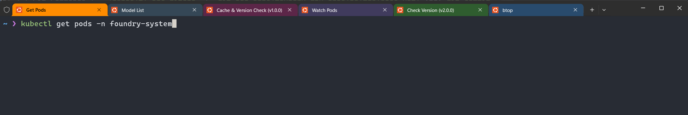

# Demo Flight Check and Talk Track

## 🎬 Flight Check

### 💻 Windows Terminal Tabs Setup

> **Note:** All kubectl commands run in Windows Terminal tabs

| Tab&nbsp;# | Purpose | Directory | Commands Ready to Run |
|------------|---------|-----------|----------------------|
| Tab&nbsp;1 | Get Pods | `~` | `kubectl get pods -n foundry-system` |
| Tab&nbsp;2 | Model List | `~` | `kubectl exec -it -n foundry-system $(kubectl get pod -n foundry-system -l app.kubernetes.io/name=foundry-local -o jsonpath='{.items[0].metadata.name}') -- /bin/bash -c "foundry model list"` |
| Tab&nbsp;3 | Cache & Version Check (v1.0.0) | `~` | `kubectl exec -n foundry-system $(kubectl get pod -n foundry-system -l app.kubernetes.io/name=foundry-local -o jsonpath='{.items[0].metadata.name}') -- /bin/bash -c "foundry cache list \| tail -n +3 \| sed 's/Model was not found in catalog//' \| awk '{print \$NF}'" && echo "" && kubectl logs -n foundry-system $(kubectl get pod -n foundry-system -l app.kubernetes.io/component=foundry -o jsonpath='{.items[0].metadata.name}') \| grep -E "(Registry:\|Repository:\|Tag:)" \| grep -v "UserAgent"` |
| Tab&nbsp;4 | Watch Pods | `~` | `kubectl get pods -n foundry-system -w` |
| Tab&nbsp;5 | Check Version (v2.0.0) | `~` | `kubectl logs -n foundry-system $(kubectl get pod -n foundry-system -l app.kubernetes.io/component=foundry -o jsonpath='{.items[0].metadata.name}') \| grep -E "(Registry:\|Repository:\|Tag:)" \| grep -v "UserAgent"` |



### 🔧 VS Code Setup

> **Note:** Each command group gets its own terminal window in VS Code - ready to just hit Enter

| Terminal/Editor | Purpose | Directory/File | Commands Ready to Run |
|-----------------|---------|----------------|----------------------|
| Terminal 1 | Blank | `~/repos/fl-arc-gitops` | (Empty - for clean demo start) |
| Terminal 2 | ORAS Push | `~/repos/fl-arc-gitops` | `cd apps/foundry-gpu-oras/models && oras push foundryoci.azurecr.io/byo-models-gpu/llama-3.2-1b-cuda:v2.0.0 --artifact-type "foundry/models" models.tar.gz:application/gzip` |
| Terminal 3 | Git Commands | `~/repos/fl-arc-gitops` | `git add apps/foundry-gpu-oras/helmrelease.yaml`<br>`git commit -m "Upgrade Foundry Local GPU model to v2.0.0"`<br>`git push origin main` |
| Editor Tab | HelmRelease File | `apps/foundry-gpu-oras/helmrelease.yaml` | Open and ready - Change line 36: `v1.0.0` → `v2.0.0` |


### 🌐 Browser Tabs

| Browser | Tab | URL/Purpose |
|---------|-----|-------------|
| Edge | Tab 1 | Azure Portal - Arc-enabled cluster (GitOps configuration) |
| Edge | Tab 2 | Azure Portal - Container Registry (ACR with `byo-models-gpu/llama-3.2-1b-cuda` repo) |
| Edge | Tab 3 | GitHub - fl-arc-gitops repository |
| Edge | Tab 4 | Open WebUI - Model interaction |


### 🎯 Demo Flow Overview

| Order | Interface | Purpose | Details |
|-------|-----------|---------|---------|
| 1 | 🌐 Browser Tab 1 | Show Arc-enabled cluster | Azure Portal - GitOps configuration |
| 2 | 🌐 Browser Tab 2 | Show ACR with v1.0.0 tag | Azure Portal - Container Registry |
| 3 | 🌐 Browser Tab 3 | Show GitHub repo | GitHub - fl-arc-gitops repository |
| 4 | 🔧 VS Code Editor | Show helmrelease.yaml | View v1.0.0 tag reference on line 36 |
| 5 | 💻 Windows Terminal Tab 1 | Get pods | Check current running pods |
| 6 | 💻 Windows Terminal Tab 2 | Model list | Show available models in Foundry |
| 7 | 💻 Windows Terminal Tab 3 | Cache & version check | Show cached model and verify v1.0.0 |
| 8 | 🌐 Browser Tab 4 | Test Open WebUI | Interact with v1.0.0 model |
| 9 | 💻 Windows Terminal Tab 4 | Watch pods | Start watching for changes |
| 10 | 🔧 VS Code Terminal 2 | ORAS push | Push v2.0.0 artifact to ACR |
| 11 | 🌐 Browser Tab 2 | Verify ACR | Confirm v2.0.0 tag appeared |
| 12 | 🔧 VS Code Editor | Edit helmrelease.yaml | Change tag from v1.0.0 to v2.0.0 in helmrelease.yaml |
| 13 | 🔧 VS Code Terminal 3 | Git commands | Add, commit, push changes |
| 14 | 💻 Windows Terminal Tab 4 | Observe GitOps | Watch pod rollout (~90 seconds) |
| 15 | 💻 Windows Terminal Tab 5 | Check version | Verify new v2.0.0 version |
| 16 | 🌐 Browser Tab 4 | Test Open WebUI | Interact with v2.0.0 model |

### ✅ Pre-Flight Checklist

- Verify system is at v1.0.0 baseline
- All Windows Terminal tabs open and positioned (run `cd \` in each tab to be in `~`)
- VS Code open with `helmrelease.yaml` visible and terminals in `~/repos/fl-arc-gitops`
- All browser tabs loaded and positioned
- Architecture diagram ready to show
- Test Open WebUI connection before starting

---

# 🎤 Demo Talk Track

> **The demo starts here. Follow the checkboxes below for the complete narrative.**

---

## Opening

- [ ] Hi everyone! Today I'm going to show you how to use GitOps to manage AI model deployments on Arc-enabled Kubernetes with Foundry Local.
- [ ] We'll walk through a complete upgrade workflow - going from version 1.0.0 to version 2.0.0 of a GPU-accelerated Llama model. This is a bring-your-own-model scenario - imagine a user already has a custom model running with Foundry Local running in Kubernetes, they fine-tuned it, and now wants to push the new version using GitOps.
- [ ] The key thing here is that we never touch the cluster directly. Everything is declarative through Git, and GitOps handles the automation.
- [ ] Let's get started by looking at the architecture diagram.

## Setup

- [ ] In the Azure portal, we can see our Arc-enabled cluster with GitOps configuration pointing to our GitHub repository. Notice the HelmRelease object here - we'll come back to this.
- [ ] Still in the portal, let's look at our container registry. Here's the `byo-models-gpu/llama-3.2-1b-cuda` repository with just the v1.0.0 tag right now.
- [ ] Over in GitHub, this is the repo we just saw referenced in the GitOps config.
- [ ] And in VS Code, here's the helmrelease.yaml manifest that GitOps is watching. You can see the v1.0.0 tag reference on line 36.

## Current State

- [ ] Before we upgrade, let's see what's running right now on our Kubernetes cluster.

```bash
kubectl get pods -n foundry-system
```

- [ ] We can see two pods here - the Foundry Local pod running our AI model, and the Open WebUI frontend.

- [ ] Now let's exec into the Foundry Local pod and see what models are available. We can see there's no Llama model in the catalog - that's because this is our custom bring-your-own model:

```bash
kubectl exec -it -n foundry-system $(kubectl get pod -n foundry-system -l app.kubernetes.io/name=foundry-local -o jsonpath='{.items[0].metadata.name}') -- /bin/bash -c "foundry model list"
```

- [ ] Now let's check which model is cached and confirm the deployed version of the custom Llama model:

```bash
kubectl exec -n foundry-system $(kubectl get pod -n foundry-system -l app.kubernetes.io/name=foundry-local -o jsonpath='{.items[0].metadata.name}') -- /bin/bash -c "foundry cache list | tail -n +3 | sed 's/Model was not found in catalog//' | awk '{print \$NF}'" && echo "" && kubectl logs -n foundry-system $(kubectl get pod -n foundry-system -l app.kubernetes.io/component=foundry -o jsonpath='{.items[0].metadata.name}') | grep -E "(Registry:|Repository:|Tag:)" | grep -v "UserAgent"
```

- [ ] As you can see, we have the model cached and we're running v1.0.0.

- [ ] Let me open Open WebUI and interact with the Llama CUDA model to show it's working...

## Upgrade to v2.0.0

- [ ] Now let's trigger an upgrade to v2.0.0 and watch GitOps handle it automatically.

- [ ] First, let me start watching the pods so we can see the changes in real-time:

```bash
kubectl get pods -n foundry-system -w
```

- [ ] Now I'm going to push the v2.0.0 model artifact to ACR. ORAS (OCI Registry as Storage) lets us store AI models as OCI artifacts in ACR, just like container images. Let's switch to VS Code.

```bash
cd apps/foundry-gpu-oras/models
oras push foundryoci.azurecr.io/byo-models-gpu/llama-3.2-1b-cuda:v2.0.0 \
  --artifact-type "foundry/models" \
  models.tar.gz:application/gzip
```

- [ ] Let's go back to the Azure portal and verify the new tag appeared in ACR. There it is - we now have both v1.0.0 and v2.0.0.

- [ ] Now I need to update Git to tell the GitOps operator on the Kubernetes cluster about this new version. Let's change the tag from v1.0.0 to v2.0.0 in helmrelease.yaml...

```bash
git add apps/foundry-gpu-oras/helmrelease.yaml
git commit -m "Upgrade Foundry Local GPU model to v2.0.0"
git push origin main
```

- [ ] Now let's watch the pods and see GitOps in action...

**[PAUSE RECORDING - Resume when new pod is Running and Ready]**

- [ ] As we can see, the GitOps operator detected the change, the old pod terminated, a new pod started, downloaded the v2.0.0 model, and now it's ready. This whole process took about 90 seconds.

## Verification

- [ ] Let's verify the upgrade worked:

```bash
kubectl logs -n foundry-system $(kubectl get pod -n foundry-system -l app.kubernetes.io/component=foundry -o jsonpath='{.items[0].metadata.name}') | grep -E "(Registry:|Repository:|Tag:)" | grep -v "UserAgent"
```

- [ ] Perfect - we're now running v2.0.0!

- [ ] And let's test it in Open WebUI to confirm the new model is working...

## Closing

- [ ] And that's it! We just demonstrated a complete GitOps workflow for upgrading an AI model on Kubernetes. The key takeaway here is that we never touched the cluster directly - we just pushed a new artifact to the registry and updated Git. GitOps handled the entire deployment automatically.
- [ ] This same pattern works for any model upgrade, rollback, or configuration change. Git is the single source of truth, and the cluster converges to match it.
- [ ] Thanks for watching!
